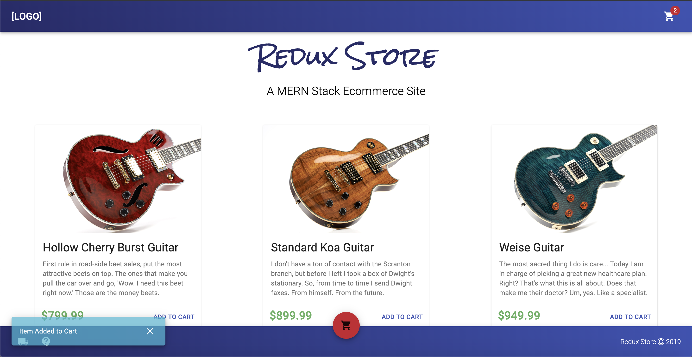

# React Redux Store

A customizable, templated, React/Redux ecommerce site. **Stand up a working ecommerce site from scratch in under an hour.**

Check out a test demo at https://redux.store _(Cool domain right?)_



## How to Use

### Set Up

1. Register for the Stripe API [here](https://dashboard.stripe.com/register). Take note of your public and secret keys for both the test and live environments, you'll need them later.
2. Register for the Easyship API [here](https://app.easyship.com/signup)
3. _OPTIONAL_: Set up your custom domain with Google [here](https://gsuite.google.com/solutions/new-business/) _(this will enable sending emails from `whatever@yourdomain.com`)_.
4. Enable `Less Secure Apps` on the Gmail account you will be using _(this is needed to run Nodemailer with Gmail)_
5. Add the following environment variables:

```
STRIPE_TEST_PK= <YOUR STRIPE TEST PUBLIC KEY>
STRIPE_TEST_SK= <YOUR STRIPE TEST SECRET KEY>

STRIPE_LIVE_PK= <YOUR STRIPE LIVE PUBLIC KEY>
STRIPE_LIVE_SK= <YOUR STRIPE LIVE SECRET KEY>

STRIPE_MODE=test

EASYSHIP_TOKEN= <YOUR EASYSHIP API ACCESS TOKEN>

EMAIL_USER= <YOUR GMAIL EMAIL ACCOUNT>
EMAIL_PW= <YOUR GMAIL EMAIL PASSWORD>

ADMIN_KEY= <KEY TO AUTHENTICATE ADMIN FOR PROTECTED API CALLS>
```

_NOTE: The `ADMIN_KEY` variable can be whatever you'd like, although a long alpha numeric key is recommended._

6. Customize the `config.json` file at the root of the repository to your liking.
7. Grab a beer and make some money 🍻💵

### Handling Inventory

#### Adding Inventory

To add inventory to your store, make a post request to the `/api/inventory` api endpoint. View an example of the request body below:

**This is an admin restricted route, so you must pass in the admin key you created as the `Authorization` header.**

```
{
    "name": "Super Rad React Shirt",
    "desc": "A cool, super rad React shirt with an ulta cool description.",
    "image": "https://reactjs.org/static/react-50k-tshirt-dd4bfca3eacb85dc3c81fe91fb2e1c10-a6b71.jpg",
    "price": "1995"
}

```

_NOTE: Price is listed in units of $0.01, so 1995 = $19.95_

#### Updating Inventory

To update inventory, make a put request to `/api/inventory/:itemId` api endpoint. View an example of the request body below:

**This is an admin restricted route, so you must pass in the admin key you created as the `Authorization` header.**

```
{
    "price": "2599"
}

```

#### Viewing Inventory

To view inventory, make a get request to `/api/inventory/`. View an example response below:

```
[
    {
        "_id": "5ddc2a2fa9fca700445aabc1",
        "name": "Super Rad React Shirt",
        "desc": "A cool, super rad React shirt with an ulta cool description.",
        "image": "https://reactjs.org/static/react-50k-tshirt-dd4bfca3eacb85dc3c81fe91fb2e1c10-a6b71.jpg",
        "price": "1995",
        "__v": 0
    },
    {
        "_id": "5ddc2a3ca9fca700445aabc2",
        "name": "Even Cooler React Shirt",
        "desc": "This is essentially the same shirt but even cooler with an even better description.",
        "image": "https://reactjs.org/static/react-50k-tshirt-dd4bfca3eacb85dc3c81fe91fb2e1c10-a6b71.jpg",
        "price": "2295",
        "__v": 0
    }
]
```

#### Emptying Inventory

To update inventory, make a delete request to `/api/inventory/` api endpoint.

**This is an admin restricted route, so you must pass in the admin key you created as the `Authorization` header.**

### Handling Orders

#### Get All Orders

To view all orders, make a get request to `/api/orders/status`. View an example response below:

**This is an admin restricted route, so you must pass in the admin key you created as the `Authorization` header.**

```
[
    {
        "cart": [
            {
                "_id": "5ddc2a2fa9fca700445aabc1",
                "price": "1995",
                "name": "Super Rad React Shirt",
                "qty": 1
            }
        ],
        "_id": "5ddc31fbf2e230004436ed95",
        "confirmation": "SZFO4Y",
        "orderStatus": "SHIPPED",
        "time": "2019-11-25T19:56:42.293Z",
        "customer": {
            "email": "user@example.com",
            "firstName": "Justin",
            "lastName": "Kunz"
        },
        "total": {
            "subtotal": 400,
            "tax": 28,
            "shippingCost": 318,
            "total": 746
        },
        "address": {
            "addressLine1": "123 Main Street",
            "addressLine2": "",
            "city": "Allen",
            "state": "TX",
            "zip": "75013"
        },
        "shipping": {
            "timeframe": {
                "days": {
                    "min_delivery_time": 3,
                    "max_delivery_time": 5
                },
                "dates": {
                    "min": "12/02/2019",
                    "max": "12/04/2019"
                }
            },
            "total": 318,
            "courier": "USPS - First Class",
            "courier_id": "dfa5ba0d-4f91-4f6d-9622-8f1a22b23855"
        },
        "payment": {
            "stripeToken": "tok_xxxxxxxxxxxxxxx",
            "last4": "4242",
            "cardIssuer": "Visa",
            "cardCountry": "US",
            "cardZip": "42424",
            "outcome": {
                "network_status": "approved_by_network",
                "reason": null,
                "risk_level": "normal",
                "risk_score": 60,
                "seller_message": "Payment complete.",
                "type": "authorized",
                "id": "ch_1FinfqG1Y9MP6uT15mIqT0qd"
            }
        },
        "__v": 0
    }
]
```

### Update Order Status

To update an orders status, make a post request to `/api/orders/status/:orderId`. View an example of the request body below:

**This is an admin restricted route, so you must pass in the admin key you created as the `Authorization` header.**

```
{
    "status": "SHIPPED"
}

```
